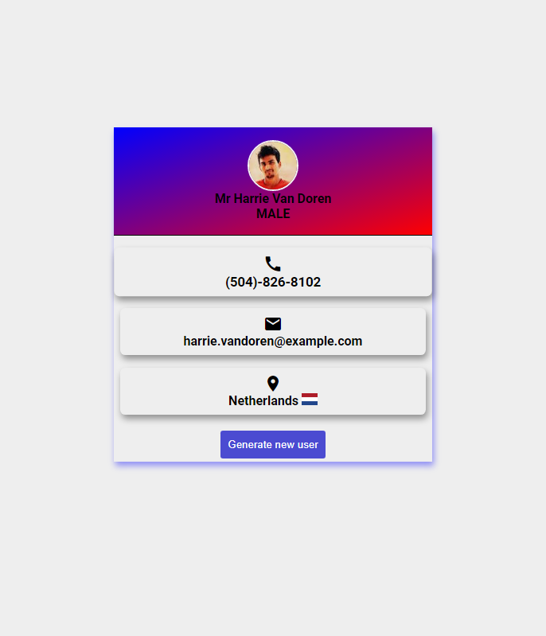

> ## Random User


### Link to the live website:
>[Random User](https://devrandomuser.netlify.app/ "randomuser live site")
___

### Description 
>Random user is a webapp that calls different Api to generate random profile such as name, country flag, gender etc...
____

#### Tech Used:
 >Html, CSS, JavaScript, git, github, Netlify.
___

> #### Things i have learnt? 
> How to call multiple Apis and display the data on the UI
```JavaScript
// Calling Multiple Api's
getUser = async () => {
    data = await fetch('https://randomuser.me/api/');
    response = await data.json();

    // To get country info(flag)
    data2 = await fetch(`https://restcountries.com/v3.1/name/${response.results[0].location.country}`);
    response2 = await data2.json();

    return [response.results[0], response2[0]]
}
```
---

> ### Desktop View



> #### Credits: 
Scythe